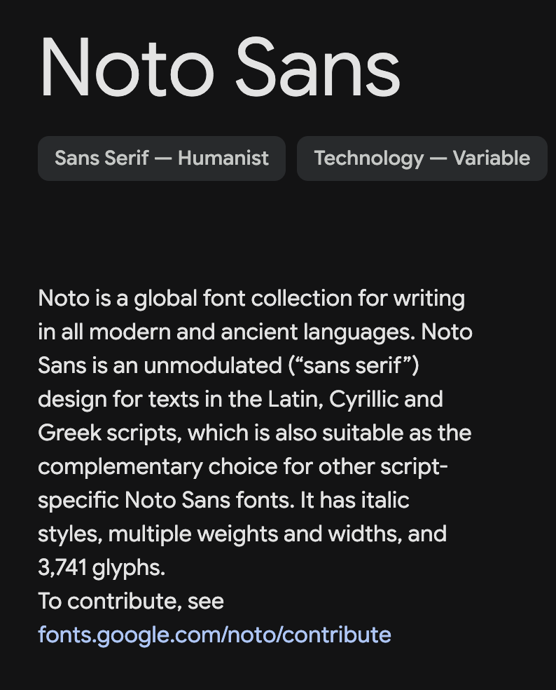
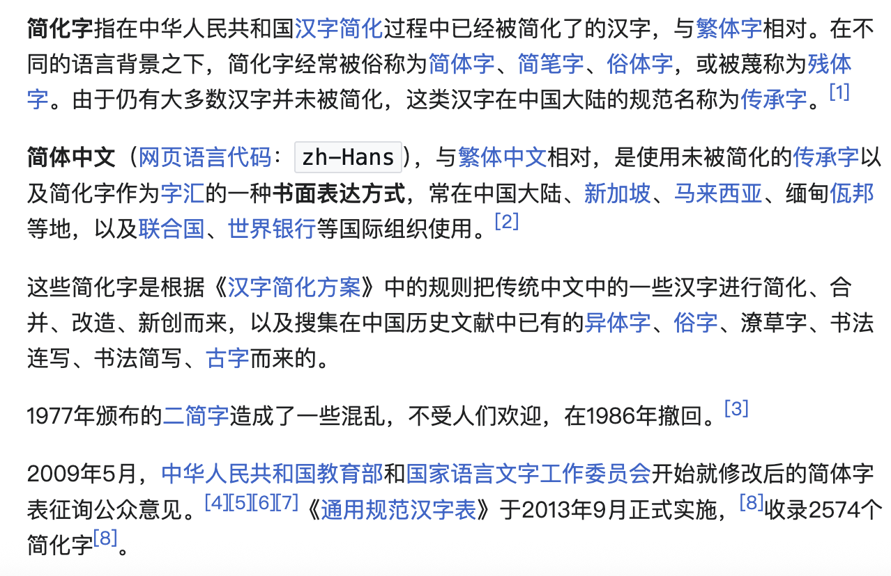
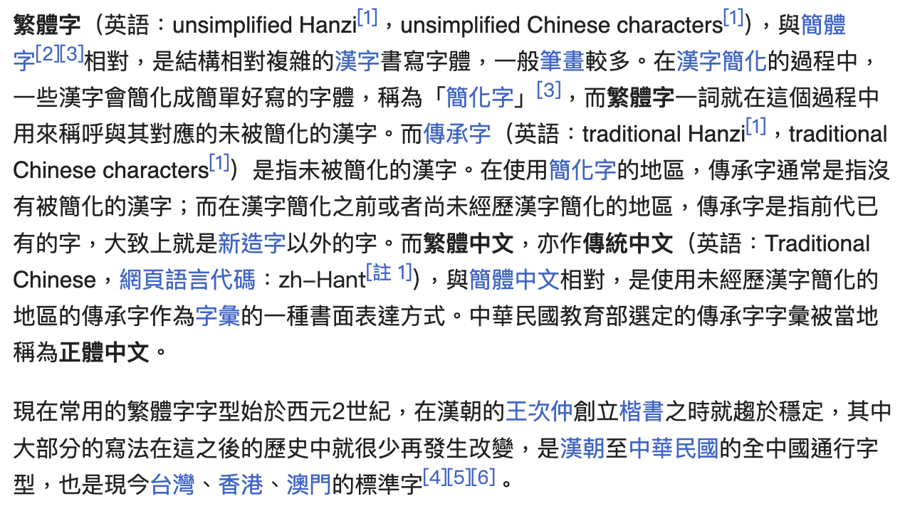
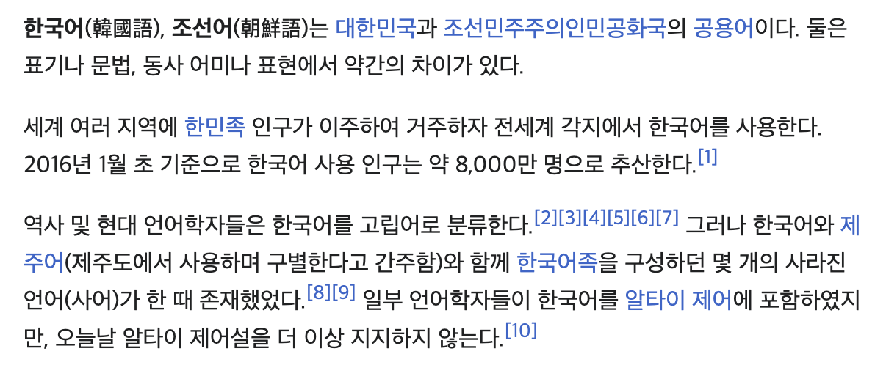
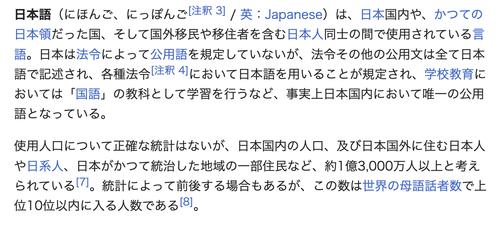

# About this project

For more information, go to [Recognizing Text in Images](https://developer.apple.com/documentation/vision/recognizing-text-in-images).

> [!WARNING]  
> You can only do this on a Mac


---

# How to use it

Compile the Swift file:
``` shell
swiftc AppleOCRTool.swift -o AppleOCRTool
```
> [!Note]
> Python will then call the binary file

---
# About the code

You can change the order of the languages for different results.

```swift
textRequest.recognitionLanguages = [
    "ja-JP",    // Japanese
    "ko-KR",    // Korean
    "zh-Hans",  // Simplified Chinese
    "zh-Hant",  // Traditional Chinese
    "en-US"     // English
]
```

## More Test cases
Please modify line 17 in Appleocr.py.

---
# Result

<table align="center">
  <tr>
    <td align="center">
      <br>
      test_img1  <a href="https://fonts.google.com/noto/specimen/Noto+Sans" target="_blank">[source]</a>
    </td>
    <td align="center">
      <br>
      test_img2 <a href="https://zh.wikipedia.org/zh-tw/%E7%AE%80%E5%8C%96%E5%AD%97" target="_blank">[source]</a>
    </td>
  </tr>
  <tr>
    <td align="center">
      <br>
      test_img3 <a href="https://zh.wikipedia.org/zh-tw/%E7%B9%81%E4%BD%93%E5%AD%97" target="_blank">[source]</a>
    </td>
    <td align="center">
      <br>
      test_img4 <a href="https://ko.wikipedia.org/wiki/%ED%95%9C%EA%B5%AD%EC%96%B4" target="_blank">[source]</a>
    </td>
  </tr>
  <tr>
    <td colspan="2" align="center">
      <br>
      test_img5 <a href="https://ja.wikipedia.org/wiki/%E6%97%A5%E6%9C%AC%E8%AA%9E" target="_blank">[source]</a>
    </td>
  </tr>
</table>

```json
{
    "test_img5": {
        "text": "日本語（にほんご、にっぽんご［注釈 31/英：Japanese）は、日本国内や、かつての\n日本領だった国、そして国外移民や移住者を含む日本人同士の間で使用されている言\n語。日本は法令によって公用語を規定していないが、法令その他の公用文は全て日本\n語で記述され、各種法令【釈 4において日本語を用いることが規定され、学校教育に\nおいては「国語」の教科として学習を行うなど、事実上日本国内において唯一の公用\n語となっている。\n使用人口について正確な統計はないが、日本国内の人口、及び日本国外に住む日本人\nや日系人、日本がかつて統治した地域の一部住民など、約1億3,000万人以上と考え\nられている！71。統計によって前後する場合もあるが、この数は世界の母語話者数で上\n位10位以内に入る人数である！81。",
        "confidence": 1.0
    },
    "test_img2": {
        "text": "筒化字指在中人民共和国字筒化対程中已経被筒化了的次字，与繁体字相対。在不\n同的語言背景之下，筒化字経常被俗称筒体字、筒笔字、俗体字，或被蔑称方残体\n字。由仍有大多数字井未被筒化，滋汊字在中国大陸的范名称労承字。［1］\n筒体中文（网語言代：zh-Hans ），与繁体中文相対，是使用未被筒化的承字以\n及筒化字作字汒的一种面表方式，常在中国大陸、新加坡、来西亜、甸佤邦\n等地，以及群合国、世界行等国組使用。［2」\n迻些筒化字是根据＜字筒化方案＞中的規則把統中文中的一些汊字行筒化、合\n井、改造、新創而来、以及搜集在中国史文献中有的昇体字、俗字、潦草字、法\n達写、法筒写、古字而来的。\n1977年頒布的二筒字造成了ー些混乱，不愛人迎，在1986年撤回。［3］\n2009年5月，中人民共和国教育部和国家語言文字工作委員会开始就修改后的筒体字\n表征海公意見。【4I5617】＜通用范沢字表）2013年9月正式実施，［81収2574↑\n筒化字181。",
        "confidence": 1.0
    },
    "test_img3": {
        "text": "繁體字（英語：unsimplified Hanzil， unsimplified Chinese characters［11）， 與簡體\n字［23］相對，是結構相對複雜的漢字書寫字體，一般筆畫較多・在漢字簡化的過程中，\n－些漢字會簡化成簡單好寫的字體，稱為「簡化字」［3］，而繁體字一詞就在這個過程中\n用來稱呼與其對應的末被簡化的漢字・而傳承字（英語：traditional Hanzil］， traditional\nChinese characters 1） 是指未被簡化的漢字・在使用簡化字的地區，傳承字通常是指沒\n有被簡化的漢字；而在漢字簡化之前或者尚未經歷漢字簡化的地區，傳承字是指前代已\n有的字，大致上就是新造字以外的字。而繁體中文，亦作傳統中文（英語：Traditional\nChinese，網頁語言代碼：zh-Hant 11），與簡體中文相對，是使用未經歴漢字簡化的\n地區的傳承字作為字彙的一種晝面表達方式・中華民國教育部選定的傅承字字彙被當地\n稱為正體中文・\n現在常用的繁體字字型始於西元2世紀，在漢朝的次仲創立楷書之時就趨於定，其中\n大部分的寫法在這之後的歴史中就很少再發生改變，是漢朝至中華民國的全中國通行字\n型，也是現今台灣、香港、澳門的標準字［4I5］6」。",
        "confidence": 1.0
    },
    "test_img1": {
        "text": "Noto Sans\nSans Serif - Humanist\nTechnology - Variable\nNoto is a global font collection for writing\nin all modern and ancient languages. Noto\nSans is an unmodulated （\"sans serif\"）\ndesign for texts in the Latin, Cyrilic and\nGreek scripts, which is also suitable as the\ncomplementary choice for other script-\nspecific Noto Sans fonts. It has italic\nstyles, multiple weights and widths, and\n3,741 glyphs.\nTo contribute, see\nfonts.google.com/noto/contribute",
        "confidence": 1.0
    },
    "test_img4": {
        "text": "",
        "confidence": 0.0
    }
}
```

## About the result
This shows how the order of the languages in the code affects the OCR.

